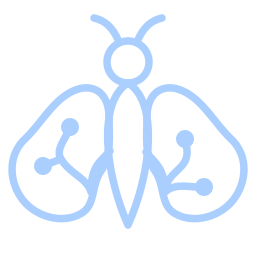
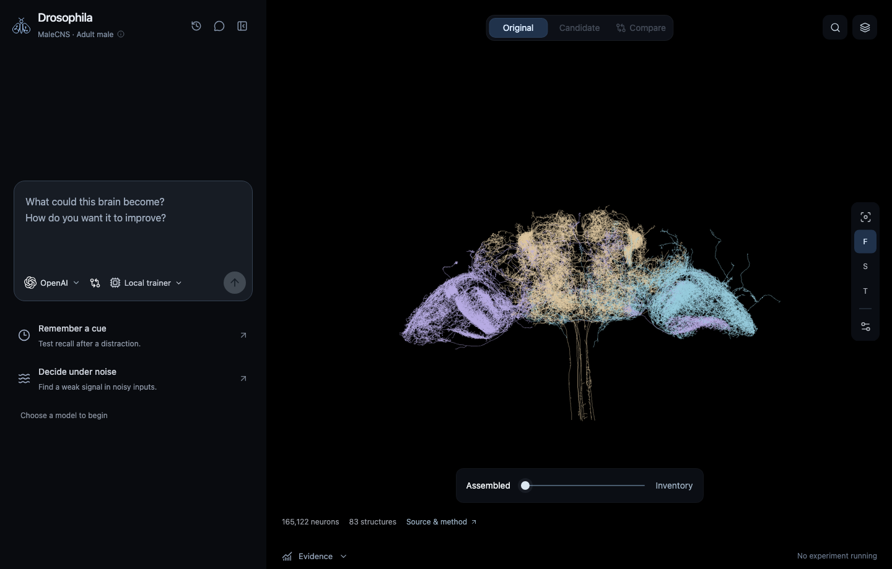
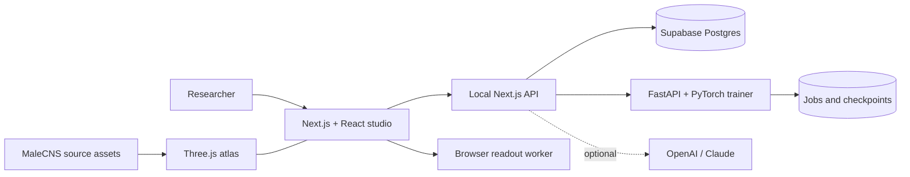

<div align="center">



# Drosophila Lab

**Explore a fruit-fly connectome. Modify its computational architecture. Measure what changes.**

An interactive 3D brain atlas and local research workspace for **connectomics**, **computational neuroscience**, and **connectome-based neural architecture search**, built on the MaleCNS dataset.

[](https://github.com/PouyanJay/drosophila-lab/actions/workflows/ci.yml)
[](LICENSE)
[](https://male-cns.janelia.org/download/)
[](pyproject.toml)
[](research/lab)
[](src/features/atlas)

[Quick start](#quick-start) · [Capabilities](#what-you-can-do) · [Research model](#research-model) · [Architecture](#architecture) · [Documentation](#documentation) · [Contributing](CONTRIBUTING.md)



_The local workspace: experiment conversation, measured anatomy, and comparison controls._

</div>

## Why this lab exists

A connectome describes neural wiring. This lab turns that measured structure into an inspectable computational model: explore the anatomy, propose a structural change, train an original/candidate pair, and examine the evidence.

It brings biological source identity, architecture experiments, and reproducible evaluation into one workspace. It is useful for exploring **brain-inspired AI** and **NeuroAI** questions while keeping engineered changes distinguishable from biological observations.

| Retained neurons | Directed connections | Observed synapses | Atlas region surfaces |
| ---------------: | -------------------: | ----------------: | --------------------: |
|      **165,122** |        **6,235,682** |    **89,731,552** |                **83** |

These are the lab's retained MaleCNS v1.0 graph counts: all neurons marked `Traced`, including unpositioned and unclassified nodes, with directed edges containing at least five observed synapses. They are not counts for every neuron in the published reconstruction. [Graph manifest](public/research/graph.json) · [Atlas provenance](public/malecns/manifest.json)

## What you can do

| Capability                         | In the workspace                                                                                                                                            |
| ---------------------------------- | ----------------------------------------------------------------------------------------------------------------------------------------------------------- |
| **Explore measured anatomy**       | Orbit the Three.js atlas, find source neurons, inspect morphology, isolate regions, use cutaways, and separate structures into an inventory.                |
| **Compare neural architectures**   | Train source-derived candidates against the original topology, with explicit source-neuron ancestry and matched experiment settings.                        |
| **Search structural changes**      | Run bounded architecture-discovery campaigns with duplication, divergence, recurrent loops, and rewiring; rank on validation data and confirm one finalist. |
| **Inspect evidence**               | Review learning curves, paired decisions, seed variation, held-out results, latency, ablations, and checksummed artifacts.                                  |
| **Keep experiments running**       | The local Python trainer retains jobs and checkpoints across browser closure and supports pause, resume, cancellation, and restart recovery.                |
| **Work with an optional AI guide** | Connect OpenAI or Claude to draft and discuss validated experiment plans, or use the explicit Offline guide. Starting training remains a separate action.   |

### A first experiment

1. Run the lab and inspect the source anatomy.
2. Choose **Offline guide**, or connect an AI provider through the model menu.
3. Start with **Remember a cue** or **Decide under noise**. Review the proposed task and configuration.
4. Use **Local trainer** for full-network training, then explicitly start the run.
5. Open the evidence, compare original and candidate, and download the run artifacts.

For structural search, select **Architecture discovery mode** in the composer. Its built-in task adapters cover cue memory, sequence recall, and noisy evidence. [Discovery workflow and export/replay guide](docs/discovery.md)

## Quick start

```sh
git clone https://github.com/PouyanJay/drosophila-lab.git
cd drosophila-lab
make run
```

`make run` resolves locked pnpm and **uv** dependencies, starts or reuses Docker, starts Supabase and the CPU PyTorch trainer, applies migrations, checks readiness, and prints the website URL. It normally uses **http://localhost:3000**; occupied default ports get alternatives.

**Host requirements:** Make, Bash, curl, and Docker support. On macOS the launcher can install Docker Desktop through an existing Homebrew installation; Linux needs Docker Engine with Compose; Windows uses WSL2 with Docker integration. Allow several GB of disk space and at least 8 GB assigned to Docker. First launch downloads dependencies and container images. [Full prerequisites and troubleshooting](docs/local-workspace.md)

An AI-provider key is optional. Offline guide and local experiments work without paid inference. The first setup needs network access for downloads.

| Command                     | Purpose                                                                |
| --------------------------- | ---------------------------------------------------------------------- |
| `make help`                 | All commands, grouped by workflow                                      |
| `make run`                  | Resolve dependencies and launch the complete workspace                 |
| `make status` / `make logs` | Inspect services or follow website logs                                |
| `make stop`                 | Stop the lab while retaining data and checkpoints                      |
| `make check`                | Formatting, types, lint, tests, agent validation, and production build |
| `make test-python`          | Numerical trainer and offline-runner tests                             |
| `make backup`               | Back up the private database, artifacts, and required keys             |

Keys stay in ignored local configuration; stored provider credentials are encrypted. Preserve `.env.local` with your database and private backups. This is a local research workspace; exposing it as a public hosted service requires a separate deployment/security design.

## Research model

The lab offers distinct execution paths:

| Mode                           | What changes                                                                                                                            | Execution and persistence                                                                       |
| ------------------------------ | --------------------------------------------------------------------------------------------------------------------------------------- | ----------------------------------------------------------------------------------------------- |
| **Full-network experiment**    | Sign-preserving recurrent connection multipliers, class dynamics, sensory encoder, and readout; source-copy candidates retain ancestry. | Python/PyTorch trainer; durable jobs and checkpoints.                                           |
| **Architecture discovery**     | Bounded structural edits plus paired training; validation selects a candidate before held-out confirmation.                             | The local trainer; versioned, checksummed variant exports.                                      |
| **Browser readout experiment** | A 55-parameter logistic readout over class activity features; internal recurrent connections stay fixed.                                | Browser worker, WebGPU when available with CPU fallback; computation stops when its tab closes. |

The retained differentiable offline runner at `/archive` has its own protocol and parameterization. The earlier bounded circuit workspace remains at `/circuits`. [Offline runner protocol](research/PROTOCOL.md)

### How to interpret the results

- Tasks are controlled synthetic capability checks. They do not establish general intelligence, biological fidelity, or a generally superior architecture.
- Source-derived copies and rewiring are engineered changes. Their ancestry is recorded; new biological observations or anatomical positions are not invented.
- Training, validation, and held-out evaluation have separate roles. Paired seeds, checkpoint selection, ablation, and replay help make comparisons inspectable.
- Arena motion is schematic decision playback, not a learned embodied navigation policy. Latency is machine-dependent computation time, not biological speed.
- Bundled results include successful, unchanged, and ablation-sensitive outcomes. For example, the recorded three-seed full-network pilot scored **58.33% for both architectures**; expansion did not improve accuracy. [Recorded report](public/research/lab-example.json)

## Architecture



| Location                                      | Responsibility                                                                  |
| --------------------------------------------- | ------------------------------------------------------------------------------- |
| [`src/features/`](src/features)               | Studio, anatomy viewer, model/compute menus, and retained workbenches           |
| [`src/app/`](src/app)                         | Pages and HTTP entrypoints                                                      |
| [`src/server/`](src/server)                   | Private database, credentials, guide, and trainer services                      |
| [`research/lab/`](research/lab)               | Persistent trainer, structural search, replay, and numerical tests              |
| [`public/`](public)                           | Source-derived assets, graph manifests, browser workers, and recorded artifacts |
| [`scripts/`](scripts)                         | uv/pnpm setup, Docker lifecycle, data utilities, and verification               |
| [`.claude/`](.claude) / [`.agents/`](.agents) | Shared project skills, with Claude and Codex reviewer configurations            |

[Directory map and dependency boundaries](docs/architecture.md)

## Verification

`make check` runs the maintained web/Python checks and builds the application. Tests cover graph identity, sparse math and gradients, source-copy ancestry, deterministic replay, persistence, HTTP contracts, encryption boundaries, and local lifecycle behavior.

Provider responses and some trainer HTTP contracts are mocked in automated checks. A real small full-graph training smoke check is available after startup:

```sh
LAB_TEST_ORIGIN=http://localhost:3000 node scripts/test-local-stack.mjs
```

Use the URL printed by `make run`. The smoke check saves an actual run and verifies its downloaded artifact checksum. GPU, WebGPU, paid-provider, and scientific-performance claims require their own environment-specific evidence. The current ESLint baseline is documented in the [architecture guide](docs/architecture.md#initial-refactor-limits).

## Documentation

| Guide                                                | Read it for                                                        |
| ---------------------------------------------------- | ------------------------------------------------------------------ |
| [Local workspace](docs/local-workspace.md)           | Prerequisites, ports, Docker, persistence, backups, and recovery   |
| [Architecture discovery](docs/discovery.md)          | Search tasks, objective, candidate edits, confirmation, and replay |
| [Discovery validation](docs/validation-discovery.md) | Recorded measurements and their limits                             |
| [Architecture](docs/architecture.md)                 | Code organization and dependency rules                             |
| [Research protocol](research/PROTOCOL.md)            | The archived offline runner's model and evaluation design          |
| [Trainer setup](research/lab/SETUP.md)               | Standalone trainer kit and advanced setup                          |
| [Contributing](CONTRIBUTING.md)                      | Development checks, code conventions, and coding-agent guidance    |

## Contributing

Bug reports, reproducibility reports, and focused improvements are welcome. Include the relevant command, environment, configuration, and actual versus expected behavior. For numerical changes, preserve source identity and include the evidence needed to assess the result. Start with [CONTRIBUTING.md](CONTRIBUTING.md) or [open an issue](https://github.com/PouyanJay/drosophila-lab/issues/new/choose).

## Data, attribution, and license

**Code:** [MIT](LICENSE). **MaleCNS data:** [CC BY 4.0](https://creativecommons.org/licenses/by/4.0/), with source URLs and checksums retained in the manifests.

The MaleCNS reconstruction is from **FlyEM / HHMI Janelia, the University of Cambridge, the MRC Laboratory of Molecular Biology, and Google Research**. See the [official MaleCNS project](https://male-cns.janelia.org/) and [data download and attribution page](https://male-cns.janelia.org/download/). This lab is an independent software project built on that work.

When using the lab in research, record the repository commit, graph fingerprint, experiment configuration, and artifact checksums, and cite the original MaleCNS dataset alongside the software. Third-party assets retain their own license notices.
