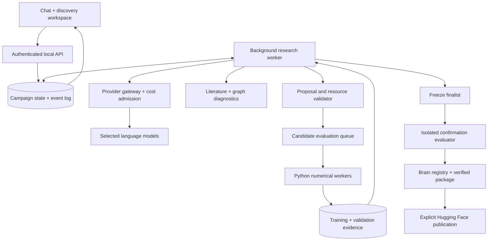

# Agent-driven brain discovery

**Design draft · 17 September 2026 · for discussion, not an implemented feature**

## 1. Product goal

Given a source brain and a well-defined task, an autonomous research service investigates limitations, forms testable hypotheses, proposes architectural edits, runs experiments, and adapts its next proposals to the evidence. It explains its work in the lab and produces a downloadable computational brain with its complete provenance, runtime, and evaluation record.

The long-term research cycle is **source → specialist variants → independently evaluated descendants → compatible multi-brain systems**. Each generation remains usable on its own. Improvement is an experimental outcome, not a requirement that the system can satisfy by changing the scoring rules.

“Brain” here means a computational network derived from a connectome. Rewiring the computational graph is distinct from inventing measured neuron morphology or physically changing a fly. A spatial layout can visualize engineered units, but must be labeled synthetic; moving a rendered surface alone does not change computation. Spatial wiring constraints or conduction delays only affect behavior if explicitly included in the model and benchmark.

## 2. What exists and what is missing

| Current foundation                                                                                     | Required addition                                                                                                        |
| ------------------------------------------------------------------------------------------------------ | ------------------------------------------------------------------------------------------------------------------------ |
| `research/lab/discovery.py`: deterministic candidate generation, pilots, paired training, confirmation | A proposal interface that accepts validated agent choices, plus a resumable controller that decides what to try next     |
| `discovery_model.py`: inherited copies, loops and rewiring with edit history                           | Explicit node/edge selectors, expanded operators, structural validation and selectable mutation policies                 |
| `discovery_tasks.py`: registered task adapters and deterministic data generation                       | Frozen benchmark contracts, larger diagnostic suites, independent confirmation namespaces and later environment adapters |
| Persistent local trainer and job controls                                                              | Candidate-level evaluator jobs, leases, cancellation, idempotent dispatch and resource scheduling                        |
| Discovery guide and encrypted provider connections                                                     | Background agent calls using the same credentials, with purpose/campaign attribution and budget admission                |
| Spending ledger and alerts                                                                             | Reserved budgets, per-role/candidate accounting, uncertain-charge reconciliation, compute budgets                        |
| Variant export and replay from the original source                                                     | A first-class brain registry, importable package, stable loader and descendant-as-parent support                         |
| Discovery panel and conversation                                                                       | Live research events, agent decision summaries, source references, candidate lineage and intervention controls           |

The source graph is currently pinned in the trainer. Exports are not drop-in inputs to the existing graph loader; replay reconstructs a mutation program using a separately supplied original graph. “Download and continue evolving this variant” therefore needs a real import/loader milestone, not just an upload button.

## 3. The research loop

1. **Agree the experiment contract.** Brain revision, task adapter/version, input/output meaning, scenario distribution, success threshold, resource constraints, allowed edits, baselines, and confirmation protocol are frozen before search.
2. **Characterize the source.** Run baselines; inspect per-scenario errors, learning curves, connectivity, bottlenecks, recurrence, sensitivity and ablations. Establish whether the task has headroom and whether training is adequate.
3. **Research and hypothesize.** Retrieve relevant literature and prior public/authorized campaign evidence. Separate cited facts, observed diagnostics, and speculative mechanisms. State a hypothesis and a falsifiable prediction.
4. **Propose experiments.** Choose a parent, explicit edit program, expected effect, control experiment, pilot/training budget, and resource estimate. Compare several proposals when the budget permits.
5. **Validate before execution.** Deterministic code checks schema, ancestry, graph legality, memory/compute bounds, task isolation and budget. Invalid proposals are rejected with a recorded reason; agents may revise within a bounded retry budget.
6. **Evaluate.** Execute pilots and paired training through the numerical service. Persist raw metrics and artifacts independently of the agent's report.
7. **Critique and adapt.** Agents inspect allowed train/validation results, explain failed predictions, select the next experiment or abandon a hypothesis. Maintain multiple useful lineages, including accuracy/latency/size tradeoffs, rather than always extending one early winner.
8. **Freeze and confirm.** An independent evaluator tests a frozen finalist under the agreed protocol. Confirmation outcomes cannot send the same campaign back into search.
9. **Package and review.** Export either a supported improvement or an explicitly experimental/no-improvement outcome. Prepare the model card, inference example and evidence. Publication is a separate explicit action or a policy explicitly authorized for that campaign.

The scientist chooses experiments; the numerical evaluator supplies scores and determines whether the declared criterion is met. An LLM's favorable explanation is not an evaluation result.

### Agents and tools

Start with distinct roles and tool permissions, not a permanently running swarm. Roles may use the same selected model with separate task contexts. Parallel proposals are bounded by money, memory, and available trainer capacity.

| Role                  | Responsibilities                                                                   | Output                                                             |
| --------------------- | ---------------------------------------------------------------------------------- | ------------------------------------------------------------------ |
| Lead scientist        | Maintain objective, research agenda, hypothesis archive, and experiment priorities | Next action and concise scientific rationale                       |
| Literature researcher | Search official datasets/papers, retrieve relevant passages, trace citations       | Source IDs, supported claims, uncertainties, proposed mechanisms   |
| Circuit analyst       | Inspect topology and errors, request sensitivities and ablations                   | Measured diagnostics linked to graph regions/IDs                   |
| Architecture designer | Turn a hypothesis into a concrete, bounded edit program                            | Typed proposal with parent hash, edits, controls and prediction    |
| Critic                | Challenge confounds, shortcuts, missing controls and wasted budget                 | Accept/revise/reject recommendation with evidence                  |
| Reporter              | Explain actual progress and prepare a model-card draft                             | Evidence-linked updates, limitations, reproducibility instructions |

Training, graph compilation, budget enforcement, test access, export validation and upload are software tools, not subjective agent roles. A separate LLM “reviewer” alone does not make confirmation independent.

Useful tools: `inspect_brain`, `inspect_errors`, `query_subgraph`, `read_source`, `search_literature`, `propose_edit`, `validate_edit`, `estimate_resources`, `submit_evaluation`, `read_validation`, `compare_candidates`, `request_ablation`, `freeze_finalist`, `prepare_export`. Each call records its inputs, result identity and cost. Code-authoring agents use isolated workspace editing and bounded build/test tools; they never receive a shell on the lab host.

## 4. Mutation freedom

**User decision: unrestricted architecture invention, including new modules and agent-written operators.** The service must support this in its first agentic release, not treat it as a distant optional extension. Unrestricted describes the design space; every execution still obeys the frozen task, explicit resource budget, runtime interface and evaluation boundary.

The admission paths below describe capabilities, not a permanent fixed mutation menu:

- **Built-in fast path:** select actual source IDs/subgraphs; duplicate with explicit inheritance; add/remove/rewire edges; bounded connection-strength and time-constant changes; prune units with a defined state/weight mapping. Keep the current model family and task interface.
- **Module/dynamics path:** module duplication, gated communication, additional internal state and tested new neuron/dynamics types. Each changes the declared model schema and potentially the baseline controls.
- **Agent-written code path (required for v1):** agents implement new operators, model components and training proposals in isolated workspaces, run unit/gradient/interface/resource tests, receive critic feedback, and revise code. Automated admission under the user-authorized campaign policy allows qualified code to run without asking the user about every experiment. A source-hashed implementation, test report and execution environment become part of the candidate identity. Task/environment adapters may be developed during benchmark setup, but a campaign cannot edit its frozen evaluator.

Run candidate code outside the controller and trusted evaluator: no provider or publisher credentials, no Docker socket/host mounts, no network, restricted read-only source/training inputs, bounded writable scratch, process/memory/time limits and output validation. Use a strong sandbox boundary appropriate to arbitrary code (evaluate a microVM or isolated compute worker); an ordinary container is not automatically a sufficient isolation claim. Dependency installation happens in a separate controlled build step, with pinned artifacts and no campaign secrets. Infrastructure failures and malicious/invalid outputs are rejected by the harness, not negotiated by an agent.

The evaluator owns data allocation, labels, scoring, timing, and claim status. Candidate code returns predictions through a versioned interface. Agents cannot smuggle LLM/API calls into inference or silently change input preprocessing to use unavailable information. Hardware/runtime capability limits are explicit; unsupported architecture types produce a clear admission failure rather than being flattened into a misleading graph.

Track biological reliance separately: a successful invented module may bypass the fly-derived structure. Include source-removal/rewiring controls and label such outcomes “hybrid” or “non-connectome-dependent” when warranted. They may still be useful artifacts, but do not prove a benefit from fly wiring.

Operator support is versioned. Node identities survive edits: biological IDs refer to the dataset; engineered IDs have their own namespace and ancestry. Removing or merging units never repurposes a biological body ID. Graph validation checks indexing, dimensionality, finite values, edge semantics, allowed signs, resource caps, and model-specific connectivity requirements. A recurrent graph need not be acyclic or globally connected.

Separate **architecture experiments trained under matched initialization rules** from **continuation experiments inheriting learned weights**. Warm-start performance is useful but is not evidence that topology alone improved. A proposal specifies which kind it is; reports identify inherited and newly initialized parameters. The inheritance contract records parent checkpoint digest, prior task/training history, exact parameter-transfer map, initialized/reset parameters and optimizer-state policy. Compare an inherited descendant with the unchanged parent given the same additional training budget, plus a scratch-trained architecture control when attributing gains to topology. Identify exactly which checkpoint is the downloadable brain; the current worker has no learned-weight inheritance.

## 5. Scientific evaluation that survives adaptive search

### Define “much better” before starting

Use a primary metric with a practical minimum gain, scenario-level floors, and constraints on inference latency, memory, size and training cost. Report a Pareto frontier when accuracy and resources trade off. Absolute percentage-point gain and relative gain must not be confused. Settings are user decisions; do not impose a universal gain threshold or seed count.

Task calibration is a separate phase. Current tiny synthetic tasks are useful integration fixtures but are insufficient to substantiate broad claims. The first reference benchmark should have multiple difficulties, distractors, unseen sequences/distributions, and a meaningful source baseline. New arbitrary tasks require a tested adapter; a chat request is not an executable benchmark.

### Required controls

- Original graph, trained with the same task interface and declared training protocol.
- Current deterministic search and random/legal-edit search, compared under an explicitly matched search/compute budget. Measure whether agents actually add value.
- Size/parameter/compute-matched controls where feasible; report mismatches honestly.
- Ablations for added units, changed edges, source recurrence, and any learned router/modules.
- Retention tests for previously claimed tasks when improving a descendant.
- Multiple independent campaign seeds/runs when assessing the search method, not only multiple training seeds inside one winning campaign.

### Protect evaluation across generations

Before evaluation is completed and released, agents receive train/search-validation metrics, never sealed evaluation examples, labels, seeds, checkpoints or readable files. Enforce this through separate storage/service permissions and capability-limited tools, not a prompt instruction. Public source data and public benchmark answers cannot be made private retroactively; use fresh partitions or genuinely independent generators/benchmarks for new claims.

For agent-written implementations, confirmation uses separate training and inference processes/capabilities. Training receives only its authorized training/validation data and labels. Inference receives inputs and permitted model-state artifacts, never final labels or per-example correctness feedback. Fresh inference state and explicit reset rules prevent hidden cross-example/run state from contaminating tests. The trusted harness owns scoring and timing. Freeze code, dependency/build digests, preprocessing, weights or the prescribed retraining recipe, and state/reset semantics—not only topology.

Freeze the finalist before confirmation. Generate secret run-specific confirmation namespaces rather than deriving every campaign's confirmation seeds from reused public offsets. Register consumed evaluation sets across campaigns and descendants. Once a result is revealed, it becomes development evidence for future work; further publication claims need fresh independent evaluation. Do not continue an adaptive search against repeatedly exposed test outcomes.

Choose uncertainty estimates and sample sizes appropriate to the metric and task before the run. The current small paired t-interval is exploratory evidence, not a universal guarantee. Avoid pseudoreplication: many trials from one trained seed are not many independent trained models. Repeated finalist selection, repeated campaigns and multiple tasks require an explicit multiplicity/replication policy.

Pilot promotion must allow uncertainty and slower learning candidates. Keep a deterministic baseline policy, then evaluate alternatives such as successive resource allocation with an exploration allowance. Record rejected candidates and their budgets to make selection bias visible.

## 6. Service architecture and durability

Recommended first implementation: a **dedicated background TypeScript orchestration worker**, Postgres-backed campaign state/event log, and the existing Python numerical service behind a new candidate-evaluation contract. Keep model/provider choice configurable. Framework selection is an implementation decision, not a prerequisite for useful science.

This reuses the current TypeScript credential/cost integration. Extract a small framework-neutral service core with server-only entrypoint wrappers: a standalone Node worker must not directly import Next.js route handlers or modules that assume its server runtime. Add the worker to the local Make/Docker lifecycle. Never tie campaign lifetime to a browser request or a Next.js request timeout.



A short prototype can compare an explicit state machine with LangGraph's persistence/interrupt facilities. Choose one campaign authority, not two conflicting schedulers. If LangGraph is adopted, checkpoint the same domain identifiers and enforce budgets/leases in the application; a framework does not provide scientific integrity or exactly-once external effects automatically.

Campaign states: `draft → validating → baselining → researching ↔ proposing ↔ evaluating → finalist_frozen → confirming → packaging → ready_for_review`. Explicit side states include `paused`, `awaiting_user`, `budget_exhausted`, `provider_unavailable`, `failed`, `cancelled`, and `no_improvement`. Publishing has separate states and retries.

Persist a proposal before dispatching its evaluation. Use deterministic request keys, worker leases with fencing, checkpoints and transactional event/outbox updates. Restart must not duplicate training jobs or confirmed uploads. External API timeouts may have incurred a charge: retain an unknown/in-flight record, reconcile when possible, and do not blindly reissue costly calls. Exactly-once provider billing is not guaranteed.

A pause stops new work and checkpoints/pauses current training at supported boundaries. Cancelling local HTTP requests does not guarantee that a provider stopped billing. Store the last known remote state. Model failures, missing prices or exhausted funds pause visibly; deterministic fallback only occurs if the campaign policy explicitly permits and labels it.

### Accepted initial planning budget — not execution authorization

Read-only host inspection found **Apple M5, 10 physical CPU cores, 32 GiB RAM**, with Docker currently assigned about **7.75 GiB**. The maintained local numerical path is CPU-oriented; an Apple GPU is not a CUDA device, and GPU acceleration must be implemented/validated for the relevant kernels before relying on it. Do not change Docker allocation or rent GPU capacity during planning.

| Stage                   | Proposed maximum LLM/tool spend | Compute/time envelope                                                             | Purpose                                                                                                   |
| ----------------------- | ------------------------------: | --------------------------------------------------------------------------------- | --------------------------------------------------------------------------------------------------------- |
| Calibration             |                              $5 | 30–60 minutes, one serial evaluator                                               | Measure the source baseline, memory, training throughput and proposal/token cost; not a success claim     |
| Agent shakedown         |                             $15 | 90 minutes, up to 4 proposals                                                     | Prove research → code/test → evaluate → evidence-driven next proposal and recovery                        |
| First research campaign |                         **$50** | **6 active compute hours**, up to 12 proposals, at most 1 numerical job at a time | A bounded first attempt; reserve ~30% of compute and $10 of the total for confirmation/reporting/recovery |

The user accepted these amounts as the initial planning envelope. They are policy ceilings, not provider price forecasts or promises that twelve fully trained candidates fit in six hours. Research retrieval/tool fees count toward the $50; separate paid GPU capacity is $0 by default. Keep two model-role profiles (economical research/reporting and stronger architecture/critique), with actual model IDs and price snapshots chosen at campaign launch. Stop before a new call that exceeds the reservation allowance; uncertain provider charges remain visible.

Start with 2 CPU threads per evaluator and measured per-job memory admission. Retain the current Docker allocation for calibration; if other running services leave insufficient headroom, pause and present options to allocate more memory or move the isolated worker. Do not stop unrelated projects or oversubscribe the host to meet a deadline. The sandbox and dataset footprint count against the same envelope.

After calibration, size the candidate/training/confirmation allocations using measured runtimes. If the required independent evaluation cannot fit, return “insufficient evidence within budget” and offer a revised budget before further spending. A publication/replication budget is a separate decision after the first useful result; no success-based automatic spending escalation.

### Recommended first research question

**Can a fly-derived computational network retain sequence information under longer delays and distractors more reliably, within an agreed inference-cost limit?** Build a versioned delayed-sequence benchmark using current adapters as fixtures, with held-back sequences/difficulties and a separate final test allocation. This is more diagnostic than the tiny two-input cue-recall examples. Validate baseline headroom and learning first.

For discussion: target **at least +5 percentage points** on the agreed macro-averaged score, no unacceptable per-scenario regression, and **at most 2× inference latency**. These are proposed product thresholds, not statistical power settings or promises of gain. The user can prioritize accuracy over latency or choose a different real task before the contract is frozen. These phases total at most $70 in proposed LLM/tool ceilings if all three are separately undertaken; they are not a spending authorization.

### Budget model

Track LLM spend, literature/tool fees, compute time, wall time, candidate count, storage, memory, concurrent jobs, and export/confirmation allowance separately. Reserve a conservative per-call budget before dispatch and settle against usage afterward. Keep in-flight/unknown amounts reserved. Prices are versioned estimates until provider reconciliation; do not label alerts as a hard spending cap.

Extend the current ledger beyond `guide`/`discovery-guide` to role/tool purposes and `campaignId`, `candidateId`, `hypothesisId`, `attemptId`. Record invalid-but-billed responses as well as successes. Apply per-call token/output limits and bounded context summaries. The initial spending envelope and local host are agreed for planning; provider/model selection and measured per-experiment cost remain open.

## 7. Brain package: original, descendant, composite

“Same format” should mean a **stable, versioned package schema and loader contract**, not an identical neuron count or an ability to fabricate every biological source file. Original and derived graphs must both load, run, render with appropriate provenance, and become parents through the same public API.

Proposed `BrainPackage/1`:

```text
brain/
  manifest.json            # schema, identities, file hashes, runtime requirements
  config.json              # dynamics, I/O signatures, normalization, task heads
  source/counts.npz        # immutable measured graph, with its own source node table
  source/neurons.npz       # measured IDs/classes/signs/positions for source nodes
  graph/neurons.npz        # effective nodes, including namespaced engineered IDs
  graph/source-map.json    # effective node IDs -> source ancestry, not index equality
  graph/topology.npz       # engineered connectivity with canonical edge IDs/order
  components.json         # component types, interfaces, runtime capabilities
  components/             # source-hashed agent-written modules/operators
  runtime/                # pinned build recipe, lockfiles, artifact/image digests
  weights/model.safetensors
  lineage.json             # parent package hashes, source IDs, edit program
  tasks/                   # versioned adapter descriptions and input/output examples
  evaluation/              # protocol, metrics, consumed split IDs, replay fixtures
  provenance/              # source licenses, citations, code/environment identity
  README.md                # model card: scope, use, limitations, evidence
```

Exact names are a contract-design decision, not existing compatibility. Do not encode learned weights or engineered edges as newly observed synapse counts. Source counts and source neurons retain matching dimensions; the effective graph has its own node table and source map. Trained edge tensors live in the weights artifact and align to the effective graph through canonical edge ordering/IDs and hashes. Preserve original field semantics and implement explicit adapters for legacy `counts.npz`/`neurons.npz` graphs and existing discovery bundles.

The loader validates hashes, schema, sparse shapes, resource bounds, tensor dimensions, node identity and supported runtime before allocation/execution. Tensor containers are data-only; install a reviewed, pinned runtime package rather than automatically running uploaded Python. Custom operators need explicit runtime capability/version support. Safetensors does not by itself validate scientific meaning, graph bounds or the surrounding code.

Separate **inference package** from **optional research/replay supplement** and private resumable optimizer state. Model weights are tied to exact graph edge ordering and runtime identity. Publish a complete supported runtime recipe, checksums, task encoders/decoders, expected sample outputs and meaningful limitations. Full graph/model download must work without needing the author's machine. A clean-environment smoke test verifies import, inference, visualization, replay, and starting a descendant campaign.

Example of a **proposed**, not yet implemented interface:

```python
brain = Brain.from_pretrained("owner/variant", revision="immutable-commit")
result = brain.predict(task.encode(example))
lab.start_discovery(parent=brain, objective=task, policy=policy)
```

For heterogeneous future brains, use adapters exposing `inspect`, `validate`, `compile`, `predict`, `export`, supported edits and I/O/timebase metadata. A common container does not imply every architecture supports every operator or can be directly connected. For unrestricted invention, the package also needs a versioned component manifest, source-hashed custom module code, reproducible locked build recipe and declared runtime capabilities. Pure-connectome packages retain the graph adapter; hybrid/composite packages may add modules that cannot be represented honestly as observed synapse counts. All use the same loader entrypoint, with compatibility checks and explicit installation/admission of their pinned runtime. “Identical legacy graph format for every possible invented architecture” is not a feasible promise.

### Hugging Face publication

Prepare locally; validate; show the exact model card/files and declared visibility; then upload the approved package to a chosen namespace. Use immutable Hub revisions for parent identity and record the returned commit. Tokens have the narrow required scope and never enter exports, conversations or agent contexts. Upload failure resumes safely and does not falsely mark a release complete.

Hub model repositories can hold custom PyTorch models and associated files. A custom loader is appropriate here; hosting the files does **not** automatically supply a Transformers pipeline, hosted inference endpoint or browser widget. Use model-card metadata for task, dataset, base model/parent links where applicable, license and relevant tags. Keep source-data attribution and code/model licensing explicit.

Public test/replay fixtures are consumed evidence, never the sealed evaluation set for the next release. Unconfirmed variants may be shared as experimental artifacts if explicitly chosen; they cannot carry a confirmed-improvement label.

## 8. From specialists to multi-brain systems

Start with compatible specialists using the same package contract. Explicitly define their task interfaces, state dimensions, time steps, signal scales, reset rules and licensing before composition.

1. **Composition baseline:** route or ensemble independently validated specialists with a simple declared policy. Measure best-single and simple-combination performance.
2. **Learned interfaces:** train bounded routers, encoders/decoders or bridge edges; test whether communication adds value beyond ensembling.
3. **Joint adaptation:** optimize bridge structure and, if authorized, internal modules. Track cross-task retention and negative transfer, including joint and conflicting scenarios.
4. **New composite package:** namespace every node by parent; preserve multi-parent lineage and router/bridge parameters; serialize through the common container with declared composite runtime support. Flatten to one CSR graph only when dynamics are compatible.

Do not average unrelated checkpoint tensors or join graphs by matching array indices. Compare the composite against each specialist, simple routing, and relevant budget-matched controls. Report per-task gains/regressions and resource costs; a better mean cannot conceal a failed task. Distillation into a smaller single network is a later optional research stage with its own evidence and ancestry.

## 9. Communication within the current UI

**User decision: preserve and extend the current design.** The existing conversation stays on the left, the actual atlas remains the main visual surface, and research detail extends the existing evidence drawer. Keep the current header, resizable/collapsible conversation panel, Original/Candidate/Compare controls, composer, model/compute pickers, history and Spending flow.

[Open the revised interactive workspace preview](design/discovery-concepts.html). It uses an actual current atlas capture and illustrative agent content; it controls no live campaign. The earlier standalone layout proposals are superseded.

- **Existing chat:** concise research updates, cited hypotheses, critic objections, user questions and acknowledged interventions. Add expandable proposal cards rather than replacing the conversation with an agent dashboard.
- **Existing discovery controls:** add agent model/role policy, authorized code capabilities, budget reservation and a compact current-phase/heartbeat indicator. Keep pause/resume/cancel where users already expect them.
- **Evidence → Activity:** ordered research/tool/experiment events with readable rationale and linked sources. Detailed notebook entries expand here.
- **Evidence → Experiments:** reuse curves, paired decisions and artifact controls; add candidate/code/graph diffs, controls, confirmation status and measured-versus-predicted labels.
- **Evidence → Lineage:** inspect parent/descendant relationships within the drawer. Selecting a node reuses the existing source-ancestry highlighting in the atlas. A larger inspector can expand from this area for future multi-parent composition.
- **Existing Spending:** add campaign/agent-role/candidate filters and spent/reserved/remaining amounts. No second wallet or conflicting cost total.
- **Variant detail:** a Review package action opens a sheet for files, reproducibility checks, model card, target repository and publication. No permanent publishing panel over the atlas.

New tabs should inherit current dark graphite styling, typography, density and accessibility behavior. On mobile, use the existing Conversation/Atlas/Evidence navigation. Show empty, running, failed, paused, unknown-cost, unconfirmed and confirmed states without redesigning the overall shell. The first version can ship Activity and Experiments before the expanded lineage explorer.

Every view shows current phase, active jobs, last heartbeat, queued next step, spent/reserved/remaining budget, and why a pause or stop occurred. Candidate cards show source/parent, hypothesis, explicit edits, evaluation stage, status and linked raw evidence. Separate proposed, predicted, measured, independently confirmed, failed and unknown states.

Live events are append-only, ordered and replayable with sequence cursors (SSE or equivalent with reconnect/poll fallback). Emit phase changes, tool requests/results, proposal validation, job events, checkpoint summaries, critique, confirmation status and publication status. Do not send every numerical step as a chat message. Use concise summaries with expandable evidence and citations; private model chain-of-thought is neither required nor presented as a scientific record.

User chat can ask questions, reject a pending proposal, favor a line of inquiry, pause, or request a bounded intervention. A requested change to task/scoring/source/constraints after baseline creates a new contract revision or campaign fork; it does not silently invalidate the ongoing comparison. Distinguish a user request from an accepted command and its actual completion. Keep mobile, keyboard access, reduced motion and non-color status labels part of acceptance.

### Atlas quality reference

The user selected EveryNeuron as the visual-quality reference. The [atlas research and delivery direction](design/atlas-visualization-direction.md) records verified rendering techniques, our data/rendering gaps, and a staged upgrade inside the current workspace. Include richer neuron geometry, depth shading, circuit exploration and experiment-linked comparison. Distinguish biological morphology from invented computational modules and recorded model activity.

## 10. Delivery gates

| Gate                                   | Deliverable                                                                                                                                  | Acceptance before proceeding                                                                                                                                                                                                       |
| -------------------------------------- | -------------------------------------------------------------------------------------------------------------------------------------------- | ---------------------------------------------------------------------------------------------------------------------------------------------------------------------------------------------------------------------------------- |
| 0. Benchmark + package foundation      | Agreed reference task, immutable contract, BrainPackage draft, original/variant import and roundtrip                                         | Existing data is unchanged; exported variant loads in a fresh environment and can be a parent; baseline difficulty/cost measured                                                                                                   |
| 1. Durable agent loop + code admission | Background worker, provider gateway/budgets, proposals, candidate evaluator jobs, isolated agent-written module/operator build and test path | Scripted decisions verify recovery; real sandbox adversarial tests verify boundaries before generated code runs; an authorized live smoke run authors/adopts a new operator and chooses a second experiment using the first result |
| 2. Research and critique               | Literature tools, graph diagnostics, hypothesis archive, controlled proposal diversity                                                       | Citations are retrievable; unsupported claims are labeled; agent search compared with deterministic/random controls                                                                                                                |
| 3. Transparent workspace               | Existing UI extended with research views, replayable events, cost display, intervention controls                                             | Reopening reconstructs state; pause/cancel/retry and failures are visible; displayed metrics trace to artifacts                                                                                                                    |
| 4. Confirmation + publication          | Independent evaluator, package verification, model cards, explicit HF upload                                                                 | No test access before freeze; clean-machine inference/replay; immutable release revision and truthful claim status                                                                                                                 |
| 5. Repeated discovery                  | Import published descendants, retain tasks, cross-campaign evidence registry                                                                 | Second-generation campaign preserves ancestry, uses fresh confirmation and exposes regressions                                                                                                                                     |
| 6. Brain composition                   | Router/bridge candidates and composite packages                                                                                              | Demonstrated multi-task benefit against meaningful combination controls within declared budgets                                                                                                                                    |

A gate may produce a functioning research service without a scientifically successful candidate. Product correctness and discovery success must have separate acceptance criteria. Parallel UI work can begin after the event contract stabilizes; no calendar estimate is credible until hardware, task scale and supported edits are agreed.

### Essential validation

- Brain-package roundtrip and legacy-adapter tests; inference parity before/after export; tamper/oversize/unsupported-schema rejection; install → inference → descendant campaign for a genuinely new custom component.
- Sparse/dense reference math, gradients and graph invariants for each operator; original immutability and weight-mapping tests.
- Real sandbox boundary tests attempt network/metadata access, host/container-socket access, other-job/confirmation-file access, subprocess/resource exhaustion and malformed outputs. Mocks cannot certify this isolation.
- A scripted agent consumes controlled evidence and changes its next proposal; provider replies are validated before any job dispatch.
- Crash/restart, duplicate events, lease expiry, partial tool output, provider timeout, cost-write failure, budget races, pause/cancel, disk exhaustion and failed upload tests.
- Confirmation denial tests across every tool/path; immutable task/scoring and parent identities; no post-test resumption of the same search.
- Browser checks for actual actions, streaming/reconnect, focus, small screens, and evidence-source links.
- An explicit paid/live smoke campaign after user budget authorization; controlled comparisons for claims of agent-search benefit.

## 11. Decisions for our next discussion

1. **Decided:** unrestricted architecture invention, including new modules and agent-written operators; execution remains isolated and budgeted.
2. Which task is the first meaningful benchmark, and what gain/resource tradeoff matters to you?
3. **Decided:** extend the existing chat/atlas/evidence layout; review the revised in-place Activity, Experiments and Lineage concepts.
4. **Accepted as planning budget:** $5 calibration, $15 shakedown, then $50 / six-hour first campaign ($70 maximum across all three). This does not authorize paid execution during planning.
5. Should publication always await your review, or may a campaign publish under an explicitly configured policy?

## Sources and design precedents

- [Current discovery workflow](discovery.md), [implementation map](discovery-implementation.md), and the repository code listed above establish what exists today.
- [AlphaEvolve paper](https://arxiv.org/abs/2506.13131): a useful precedent for iterative LLM proposals scored by automated evaluators. It is not evidence that this lab's brain edits will improve a task.
- [LangGraph persistence](https://docs.langchain.com/oss/python/langgraph/persistence): a candidate implementation aid for durable agent state; it does not replace our domain checks or evaluator separation.
- [Hugging Face model uploads](https://huggingface.co/docs/hub/models-uploading), [custom library integration](https://huggingface.co/docs/huggingface_hub/guides/integrations), and [model cards](https://huggingface.co/docs/hub/model-cards): support publishing custom artifacts with a defined load/save interface and descriptive metadata. Hosted inference integration is a separate concern.

External documentation checked on 17 September 2026. All proposed APIs, packages, agent roles and UI states above are design proposals, not claims of shipped functionality.
